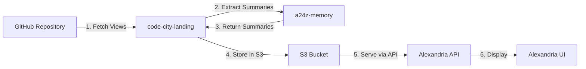

# CodebaseViewSummary Extraction Architecture

## Overview

The CodebaseViewSummary extraction is a centralized system for creating lightweight representations of CodebaseViews. This document explains the architecture, data flow, and implementation details of how summaries are extracted, stored, and consumed across the a24z ecosystem.

## Core Components

### 1. a24z-Memory (Source of Truth)

**Location**: `/src/pure-core/types/summary.ts`

The extraction logic is centralized in a24z-Memory, providing:

- **CodebaseViewSummary Interface**: Lightweight representation of a CodebaseView
- **extractCodebaseViewSummary Function**: Converts full CodebaseView to summary
- **extractCodebaseViewSummaries Function**: Batch extraction for multiple views

```typescript
export interface CodebaseViewSummary {
  id: string;                    // Unique identifier
  name: string;                  // Display name
  description: string;           // Brief description
  cellCount: number;            // Number of cells
  gridSize: [number, number];   // [rows, columns]
  overviewPath: string;         // Path to documentation
  category: string;             // UI grouping category
  displayOrder: number;         // Sort order in category
}
```

### 2. code-city-landing (Data Pipeline)

**Location**: `/src/lib/github-alexandria.ts`

Serves as the data pipeline between GitHub and S3:

1. **Fetches** CodebaseViews from GitHub repositories
2. **Extracts** summaries using `extractCodebaseViewSummary` from a24z-memory
3. **Stores** summaries in S3 via `S3AlexandriaStore`

```typescript
// github-alexandria.ts:135
import { extractCodebaseViewSummary } from 'a24z-memory';

const summary = extractCodebaseViewSummary(view);
result.views.push(summary);
```

### 3. Alexandria UI (Consumer)

**Location**: `/src/components/ViewDisplay.tsx`

Consumes pre-extracted summaries from the API:

- **Does NOT** perform extraction
- **Reads** summaries from S3 via Alexandria API
- **Displays** summary information in the UI

## Data Flow



## Implementation Details

### Extraction Process

The `extractCodebaseViewSummary` function performs these calculations:

1. **Grid Dimensions**: Iterates through all cells to find max row/column
2. **Cell Count**: Counts total number of cells in the view
3. **Metadata Mapping**: Copies essential fields with defaults:
   - `category`: Defaults to 'other' if not specified
   - `displayOrder`: Defaults to 0 for backward compatibility

### S3 Storage Structure

Summaries are stored in S3 as part of the repository registry:

```json
{
  "repositories": [
    {
      "id": "owner/name",
      "owner": "owner",
      "name": "name",
      "views": [/* CodebaseViewSummary[] */],
      "hasViews": true,
      "viewCount": 2
    }
  ]
}
```

### API Endpoints

**GET /api/alexandria/repos**
- Returns all repositories with their view summaries
- Summaries are pre-extracted and cached in S3

**POST /api/alexandria/repos**
- Registers/updates repository
- Triggers fresh extraction of view summaries
- Updates S3 cache with new summaries

## Benefits of Centralization

1. **Single Source of Truth**: All extraction logic in one place
2. **Consistency**: Same extraction algorithm across all consumers
3. **Performance**: Summaries are pre-computed and cached
4. **Separation of Concerns**: 
   - a24z-memory: Core logic
   - code-city-landing: Data pipeline
   - Alexandria: UI presentation

## Usage Examples

### Extracting a Single Summary

```typescript
import { extractCodebaseViewSummary } from 'a24z-memory';
import type { CodebaseView } from 'a24z-memory';

const view: CodebaseView = JSON.parse(viewContent);
const summary = extractCodebaseViewSummary(view);
```

### Batch Extraction

```typescript
import { extractCodebaseViewSummaries } from 'a24z-memory';

const views: CodebaseView[] = await loadAllViews();
const summaries = extractCodebaseViewSummaries(views);
```

### Consuming Summaries (Alexandria)

```typescript
import { AlexandriaAPI } from '@/lib/alexandria-api';

const api = new AlexandriaAPI();
const { repositories } = await api.getRepositories();
// Each repository includes pre-extracted view summaries
repositories.forEach(repo => {
  console.log(`${repo.name} has ${repo.views.length} views`);
});
```

## Future Considerations

### Potential Enhancements

1. **Caching Strategy**: Consider TTL-based cache invalidation
2. **Incremental Updates**: Only re-extract changed views
3. **Summary Versioning**: Track extraction algorithm versions
4. **Extended Metadata**: Add file count, complexity metrics

### Migration Path

If the summary structure needs to change:

1. Update `CodebaseViewSummary` interface in a24z-memory
2. Version the extraction function
3. Implement backward compatibility layer
4. Gradually migrate cached summaries

## Related Documentation

- [Alexandria Architecture](https://github.com/a24z-ai/alexandria/docs/ARCHITECTURE.md)
- [CodebaseView Types](./CODEBASE_VIEW_TYPES.md)
- [S3 Storage Design](https://github.com/PrincipleMD/code-city-landing/docs/S3_DESIGN.md)