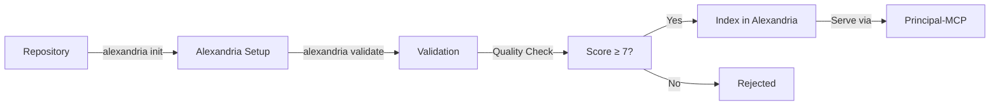

# Principal-MCP Design Document

**Version**: 1.0.0  
**Status**: Draft  
**Last Updated**: 2025-01-11

---

## Executive Summary

Principal-MCP is a Model Context Protocol (MCP) server that provides developer agents with access to high-quality, verified code patterns and architectural guidance. By restricting its knowledge base to repositories actively maintained through the Alexandria CLI, Principal-MCP ensures that every pattern served is documented, up-to-date, and production-ready.

### Core Value Proposition

- **Quality over Quantity**: Only patterns from Alexandria-managed repositories
- **Trust by Design**: Every pattern is verified, documented, and maintained
- **Context-Aware**: Leverages spatial codebase views for better understanding
- **Production-Safe**: No unvetted external sources or outdated examples

---

## Vision & Goals

### Vision
Create a trusted knowledge layer for AI developer agents that serves only high-quality, maintained patterns from repositories using Alexandria CLI documentation standards.

### Primary Goals
1. **Reliability**: Ensure agents only suggest verified, tested patterns
2. **Freshness**: Serve only actively maintained documentation
3. **Context**: Provide spatial understanding through codebase views
4. **Safety**: Eliminate security risks from unvetted sources
5. **Efficiency**: Reduce noise by focusing on quality

### Non-Goals
- Web scraping or general internet search
- Serving patterns from undocumented repositories
- Real-time code generation without verified examples
- Supporting repositories without Alexandria CLI integration

---

## Architecture Overview

### System Components

```
┌─────────────────────────────────────────────────┐
│                 Developer Agent                  │
│              (Claude, Cursor, etc.)              │
└────────────────────┬────────────────────────────┘
                     │ MCP Protocol
┌────────────────────▼────────────────────────────┐
│               Principal-MCP Server               │
│                                                  │
│  ┌──────────────────────────────────────────┐   │
│  │            MCP Tool Layer                │   │
│  │  - search_alexandria_patterns            │   │
│  │  - get_teaching_layout                   │   │
│  │  - validate_against_alexandria           │   │
│  └────────────────┬─────────────────────────┘   │
│                   │                              │
│  ┌────────────────▼─────────────────────────┐   │
│  │        Principal-MD Client               │   │
│  │     (@a24z/principal-md library)         │   │
│  └────────────────┬─────────────────────────┘   │
└───────────────────┼─────────────────────────────┘
                    │
     ┌──────────────▼──────────────┐
     │   Alexandria Database       │
     │  (Pixeltable + Embeddings)  │
     │                             │
     │  Only contains patterns     │
     │  from repos using:          │
     │  - Alexandria CLI           │
     │  - Codebase Views           │
     │  - Quality Scores ≥ 7       │
     └─────────────────────────────┘
```

### Data Flow

1. **Agent Request** → MCP tool invocation
2. **Principal-MCP** → Validates and forwards to Principal-MD
3. **Principal-MD** → Queries Alexandria database
4. **Alexandria** → Returns only verified, CLI-managed patterns
5. **Response** → Structured, attributed results to agent

---

## Boundary Definition

### What's Included ✅

- **Alexandria-Managed Repositories**: Only repos using Alexandria CLI
- **Verified Patterns**: Quality score ≥ 7, recently validated
- **Structured Documentation**: Codebase views with spatial organization
- **Local Context**: Current repository's Alexandria documentation
- **Teaching Layouts**: Curated examples for learning

### What's Excluded ❌

- **External Web Search**: No Google, Stack Overflow, etc.
- **Unmanaged Repositories**: No repos without Alexandria CLI
- **Raw Code Snippets**: No unstructured, undocumented code
- **Outdated Patterns**: No patterns > 180 days without updates
- **Low-Quality Examples**: No patterns with quality score < 7

### Trust Model

```typescript
interface TrustBoundary {
  source: "alexandria_verified";  // Single trusted source
  requirements: {
    alexandriaCLI: true;         // Must use CLI
    documentation: true;         // Must have .md files
    codebaseViews: true;        // Must have spatial organization
    qualityScore: number;        // Minimum 7/10
    lastUpdated: Date;          // Within 180 days
  };
  guarantees: {
    reviewed: boolean;           // Human or AI reviewed
    tested: boolean;            // Has test coverage
    licensed: boolean;          // Clear licensing
    maintained: boolean;        // Active maintenance
  };
}
```

---

## Tool Specifications

### Core Tools

#### 1. search_alexandria_patterns
Search for verified patterns using semantic search.

```typescript
{
  description: "Search verified patterns from Alexandria-managed repositories",
  params: {
    query: string;                    // Semantic search query
    filters?: {
      language?: string;              // "TypeScript", "Python", etc.
      framework?: string;             // "React", "Express", etc.
      difficulty?: "beginner" | "intermediate" | "advanced";
      minQuality?: number;            // 7-10, default 7
      maxAge?: number;                // Days since last update
    };
    limit?: number;                   // Max results, default 10
  },
  returns: AlexandriaPattern[];       // Verified patterns only
}
```

#### 2. get_teaching_layout
Retrieve a specific teaching layout with full spatial context.

```typescript
{
  description: "Get a complete teaching layout with code examples",
  params: {
    layoutId: string;                 // Unique layout identifier
    includeFiles?: boolean;           // Include file contents
  },
  returns: {
    layout: AlexandriaLayout;         // Spatial grid organization
    repository: RepositoryMetadata;   // Source repo info
    files?: FileContents[];           // Actual code if requested
  }
}
```

#### 3. find_similar_patterns
Find patterns similar to current implementation.

```typescript
{
  description: "Find similar verified patterns",
  params: {
    reference: string;                // Layout ID or file path
    scope?: "local" | "global";       // Search scope
    limit?: number;                   // Max results
  },
  returns: SimilarityResult[];        // Patterns with similarity scores
}
```

#### 4. validate_against_alexandria
Check if an approach aligns with verified patterns.

```typescript
{
  description: "Validate approach against Alexandria standards",
  params: {
    approach: string;                 // Description of planned approach
    context?: string[];               // Related file paths
  },
  returns: {
    aligned: boolean;                 // Follows verified patterns
    matchingPatterns: AlexandriaPattern[];
    deviations?: string[];            // How it differs
    recommendations?: string[];       // Suggested improvements
  }
}
```

#### 5. get_alexandria_context
Get Alexandria documentation for current working area.

```typescript
{
  description: "Get Alexandria-managed documentation for current area",
  params: {
    path: string;                     // File or directory path
    depth?: number;                   // How many levels to check
  },
  returns: {
    hasDocumentation: boolean;
    codebaseView?: CodebaseView;      // If area is documented
    qualityScore?: number;            // Documentation quality
    lastUpdated?: Date;               // Freshness
    guidance?: string;                // Contextual guidance
  }
}
```

#### 6. browse_pattern_categories
Browse available patterns by category.

```typescript
{
  description: "Browse Alexandria pattern categories",
  params: {
    category?: "guide" | "reference" | "tutorial" | "example";
    page?: number;
    pageSize?: number;
  },
  returns: {
    patterns: AlexandriaPattern[];
    total: number;
    categories: CategoryCount[];      // Available categories
  }
}
```

---

## Quality Guarantees

### Pattern Requirements

Every pattern served by Principal-MCP must meet:

1. **Documentation Standards**
   - Complete README with overview
   - Codebase views with spatial organization
   - File-level documentation
   - Clear learning objectives

2. **Maintenance Standards**
   - Alexandria CLI integration
   - Git hooks for validation
   - Updated within 180 days
   - Active repository (recent commits)

3. **Quality Standards**
   - Quality score ≥ 7/10
   - Peer reviewed or AI validated
   - Working code examples
   - Test coverage where applicable

### Verification Process



---

## Implementation Plan

### Phase 1: Core Infrastructure (Week 1-2)
- [ ] Set up Principal-MCP server structure
- [ ] Integrate @a24z/principal-md client
- [ ] Implement basic MCP protocol handling
- [ ] Create development environment

### Phase 2: Essential Tools (Week 3-4)
- [ ] Implement search_alexandria_patterns
- [ ] Implement get_teaching_layout
- [ ] Implement get_alexandria_context
- [ ] Add response formatting and attribution

### Phase 3: Advanced Tools (Week 5-6)
- [ ] Implement find_similar_patterns
- [ ] Implement validate_against_alexandria
- [ ] Implement browse_pattern_categories
- [ ] Add caching layer

### Phase 4: Quality & Testing (Week 7-8)
- [ ] Integration testing with Alexandria database
- [ ] Performance optimization
- [ ] Security audit
- [ ] Documentation

### Phase 5: Deployment (Week 9)
- [ ] Package for npm distribution
- [ ] Create Docker container
- [ ] Write integration guides
- [ ] Launch beta program

---

## Configuration

### Server Configuration

```json
{
  "principal-mcp": {
    "version": "1.0.0",
    "alexandria": {
      "apiUrl": "${ALEXANDRIA_API_URL}",
      "apiKey": "${ALEXANDRIA_API_KEY}",
      "database": "alexandria_verified"
    },
    "quality": {
      "minScore": 7,
      "maxAge": 180,
      "requireCLI": true,
      "requireViews": true
    },
    "cache": {
      "enabled": true,
      "ttl": 3600,
      "maxSize": "100MB"
    },
    "security": {
      "airgapped": true,
      "noExternalCalls": true,
      "auditLog": true
    }
  }
}
```

### Agent Integration

```json
{
  "mcp_servers": {
    "principal": {
      "command": "npx",
      "args": ["@a24z/principal-mcp"],
      "env": {
        "ALEXANDRIA_API_URL": "https://api.principal.md",
        "ALEXANDRIA_API_KEY": "${PRINCIPAL_API_KEY}"
      },
      "metadata": {
        "trustLevel": "verified",
        "icon": "✓",
        "description": "Verified patterns from Alexandria"
      }
    }
  }
}
```

---

## Security Considerations

### Data Security
- No external API calls except to Alexandria database
- All patterns pre-verified and indexed
- No dynamic code execution
- No user data collection

### Network Security
- Can operate in airgapped mode with local Alexandria cache
- HTTPS only for Alexandria API calls
- API key authentication
- Rate limiting per agent

### Content Security
- No injection vulnerabilities (pre-indexed content)
- Sanitized pattern metadata
- License verification
- Attribution tracking

---

## Success Metrics

### Quality Metrics
- Pattern relevance score (>0.8 average)
- Agent acceptance rate (>90%)
- False positive rate (<5%)
- Documentation coverage (100%)

### Usage Metrics
- Queries per day
- Cache hit rate
- Response time (<200ms p95)
- Pattern reuse frequency

### Impact Metrics
- Code quality improvement
- Development velocity increase
- Bug reduction rate
- Knowledge transfer efficiency

---

## Future Enhancements

### Near Term (3-6 months)
- Pattern versioning support
- Multi-language documentation
- IDE-specific optimizations
- Pattern composition tools

### Long Term (6-12 months)
- AI-powered pattern generation from verified examples
- Automated pattern quality scoring
- Cross-repository pattern migration
- Pattern effectiveness tracking

---

## Appendix

### A. Alexandria Layout Structure

```typescript
interface AlexandriaLayout {
  id: string;
  repositoryUrl: string;
  view: CodebaseView;
  metadata: {
    teaches: string;
    difficulty: "beginner" | "intermediate" | "advanced";
    qualityScore: number;
    language: string;
    framework?: string;
    tags: string[];
  };
  files: Record<string, FileReference>;
  timestamps: {
    created: Date;
    updated: Date;
    validated: Date;
  };
}
```

### B. Response Format

```typescript
interface PatternResponse {
  pattern: AlexandriaPattern;
  attribution: {
    source: string;
    repository: string;
    license: string;
    lastUpdated: Date;
  };
  confidence: number;
  metadata: {
    verified: true;
    alexandriaManaged: true;
    qualityScore: number;
  };
}
```

### C. Error Handling

```typescript
interface ErrorResponse {
  error: string;
  code: "PATTERN_NOT_FOUND" | "QUALITY_TOO_LOW" | "OUTDATED" | "NOT_VERIFIED";
  suggestion?: string;
  fallback?: AlexandriaPattern;
}
```

---

## References

- [Alexandria CLI Documentation](https://github.com/a24z/alexandria)
- [Principal-MD Package Design](./ALEXANDRIA_PACKAGE_DESIGN.md)
- [MCP Protocol Specification](https://modelcontextprotocol.io)
- [a24z-Memory Architecture](./a24z-memory-architecture.md)