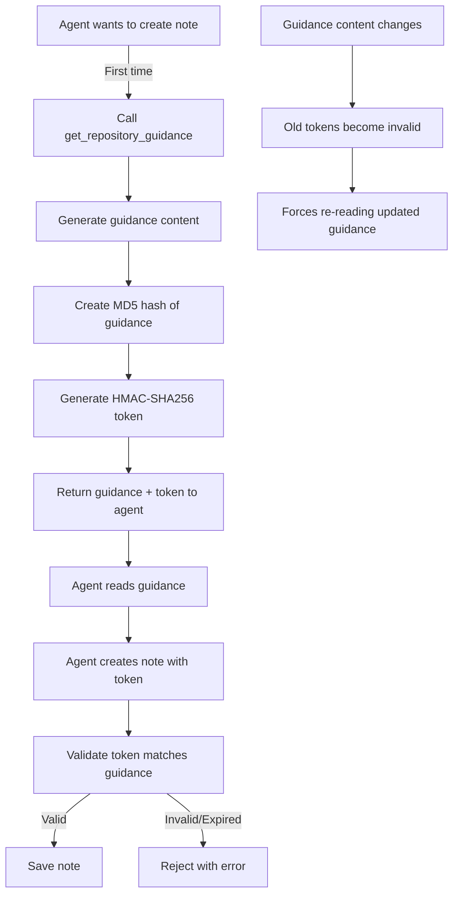

# Guidance Token System Overview

## What Are Guidance Tokens?

Guidance tokens are cryptographic proofs that demonstrate an AI agent or developer has read and understood the current repository guidelines before creating notes. They act as a "proof of reading" mechanism to ensure quality and consistency in knowledge documentation.

## Token Flow Architecture

## Token Components

### 1. Token Payload
- **guidanceHash**: MD5 hash of the full guidance content
- **path**: Repository path context
- **timestamp**: When token was generated
- **expires**: Token validity period (24 hours)

### 2. Token Signature
- HMAC-SHA256 signature using secret key
- Ensures token authenticity
- Prevents token forgery

### 3. Token Encoding
- Base64 encoded JSON containing payload + signature
- Compact, URL-safe format
- Self-contained validation data

## Security Features

### Content Integrity
- Hash ensures guidance content hasn't changed
- Any modification invalidates existing tokens
- Forces re-reading when guidelines update

### Time-Based Expiry
- Tokens expire after 24 hours
- Prevents stale guidance usage
- Encourages regular guideline review

### Cryptographic Protection
- HMAC prevents token tampering
- Secret key ensures only authorized generation
- Signature validation on every use

## Implementation Details

### Token Generation Process
1. **Collect Guidance**: Aggregate all repository configuration
2. **Create Hash**: MD5 hash of complete guidance content
3. **Build Payload**: Include hash, path, timestamps
4. **Sign Payload**: HMAC-SHA256 with secret key
5. **Encode Token**: Base64 encode JSON structure

### Token Validation Process
1. **Decode Token**: Parse Base64 to JSON
2. **Verify Signature**: Recalculate and compare HMAC
3. **Check Expiry**: Ensure current time < expires
4. **Validate Content**: Compare guidance hash with current
5. **Return Result**: Accept or reject based on all checks

## Usage Workflow

### For AI Agents
1. **Initial Request**: Agent must call `get_repository_guidance`
2. **Read Guidelines**: Parse and understand the guidance
3. **Store Token**: Keep token for subsequent operations
4. **Include in Requests**: Pass token when creating notes
5. **Handle Expiry**: Re-fetch guidance when token expires

### For Tool Integration
1. **GetRepositoryGuidanceTool**: Generates tokens
2. **CreateRepositoryNoteTool**: Requires valid tokens
3. **Other Tools**: May optionally validate tokens
4. **Token Manager**: Central validation service

## Configuration Integration

### Repository Configuration
- Stored in `.a24z/config.json`
- Defines limits, restrictions, enforcement
- Changes invalidate existing tokens

### Guidance Content
- Custom guidance in `.a24z/note-guidance.md`
- Default fallback guidance
- Combined with configuration for hashing

### Tag/Type Restrictions
- Allowed tags/types influence guidance
- Descriptions included in token validation
- Updates require new tokens

## Benefits

### Quality Assurance
- Ensures agents understand guidelines
- Prevents uninformed note creation
- Maintains documentation standards

### Change Management
- Automatic invalidation on guideline updates
- Forces awareness of new requirements
- Tracks guideline version compliance

### Security & Audit
- Cryptographic proof of guideline reading
- Time-stamped compliance tracking
- Non-repudiation of guideline awareness