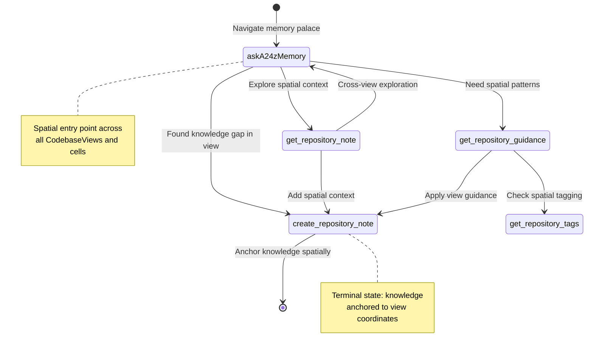
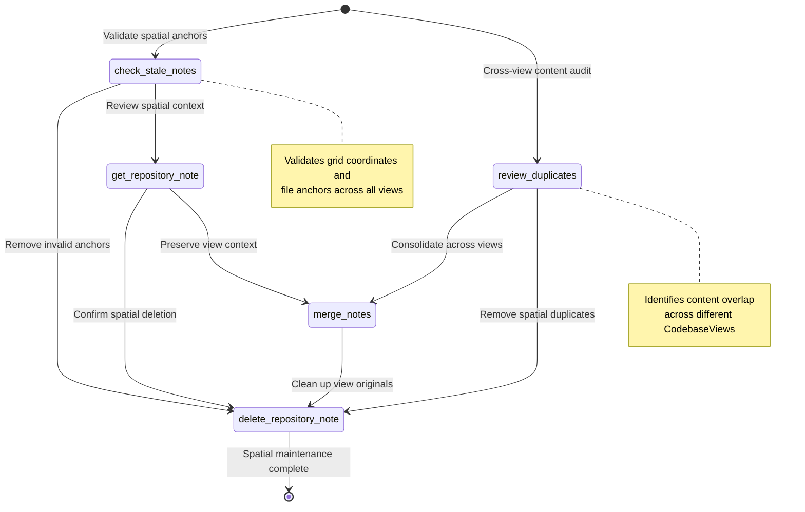
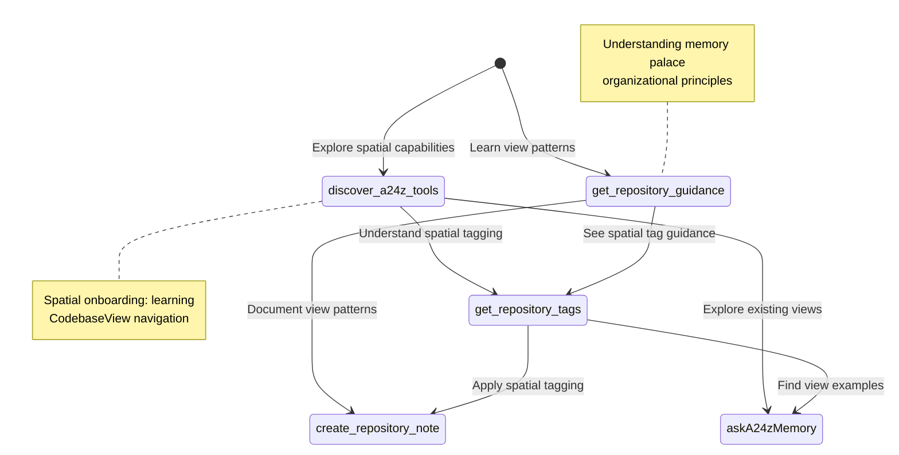

# a24z-Memory Spatial Workflows - CodebaseView Architecture

## Primary Spatial Knowledge Workflow

## Spatial Memory Palace Maintenance Workflow

## Spatial Discovery & View Creation Workflow

## Spatial Transition Probability Matrix

Based on CodebaseView-aware usage patterns:

| From → To                     | askA24z | create_note | get_note | guidance | tags | delete_note | merge | stale | duplicates | discover | similar |
| ----------------------------- | ------- | ----------- | -------- | -------- | ---- | ----------- | ----- | ----- | ---------- | -------- | ------- |
| **askA24zMemory**             | -       | 0.35        | 0.25     | 0.2      | 0.1  | -           | -     | -     | -          | -        | 0.1     |
| **create_repository_note**    | -       | -           | -        | -        | -    | -           | -     | -     | -          | -        | -       |
| **get_repository_note**       | 0.3     | 0.4         | -        | -        | -    | 0.3         | -     | -     | -          | -        | -       |
| **get_repository_guidance**   | -       | 0.6         | -        | -        | 0.4  | -           | -     | -     | -          | -        | -       |
| **get_repository_tags**       | 0.2     | 0.5         | -        | -        | -    | -           | -     | -     | -          | -        | 0.3     |
| **delete_repository_note**    | -       | -           | -        | -        | -    | -           | -     | -     | -          | -        | -       |
| **merge_notes**               | -       | -           | -        | -        | -    | 0.7         | -     | -     | -          | -        | -       |
| **check_stale_notes**         | -       | -           | 0.4      | -        | -    | 0.6         | -     | -     | -          | -        | -       |
| **review_duplicates**         | -       | -           | -        | -        | -    | 0.3         | 0.7   | -     | -          | -        | -       |
| **discover_a24z_tools**       | 0.4     | -           | -        | 0.3      | 0.3  | -           | -     | -     | -          | -        | -       |
| **find_similar_notes**        | 0.2     | 0.4         | 0.2      | -        | -    | -           | 0.2   | -     | -          | -        | -       |

**Spatial Architecture Legend:**

- **Terminal States**: create_repository_note, delete_repository_note (spatially anchored endpoints)
- **Entry States**: askA24zMemory, discover_a24z_tools, check_stale_notes, review_duplicates
- **Transition States**: get_repository_note, get_repository_guidance, get_repository_tags, merge_notes, find_similar_notes
- **Spatial Context**: All transitions now consider CodebaseView associations and grid coordinates

## New Spatial-Aware Tool Behaviors

### Enhanced Spatial Navigation
- **askA24zMemory**: Now searches across CodebaseViews and respects grid positioning
- **create_repository_note**: Requires CodebaseView association, supports cell coordinates
- **find_similar_notes**: Considers spatial proximity in similarity scoring
- **check_stale_notes**: Validates both file anchors and view configurations
