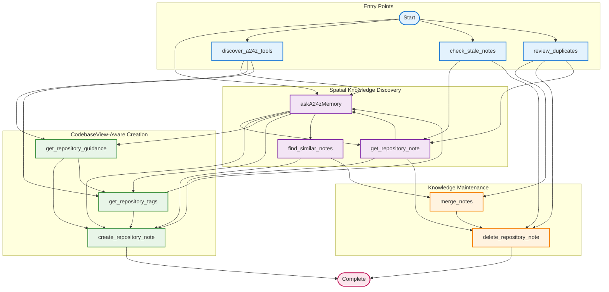
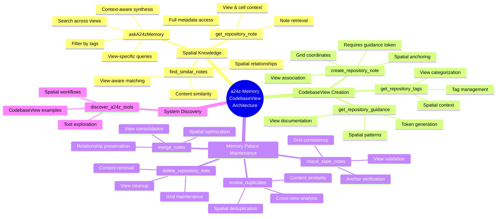
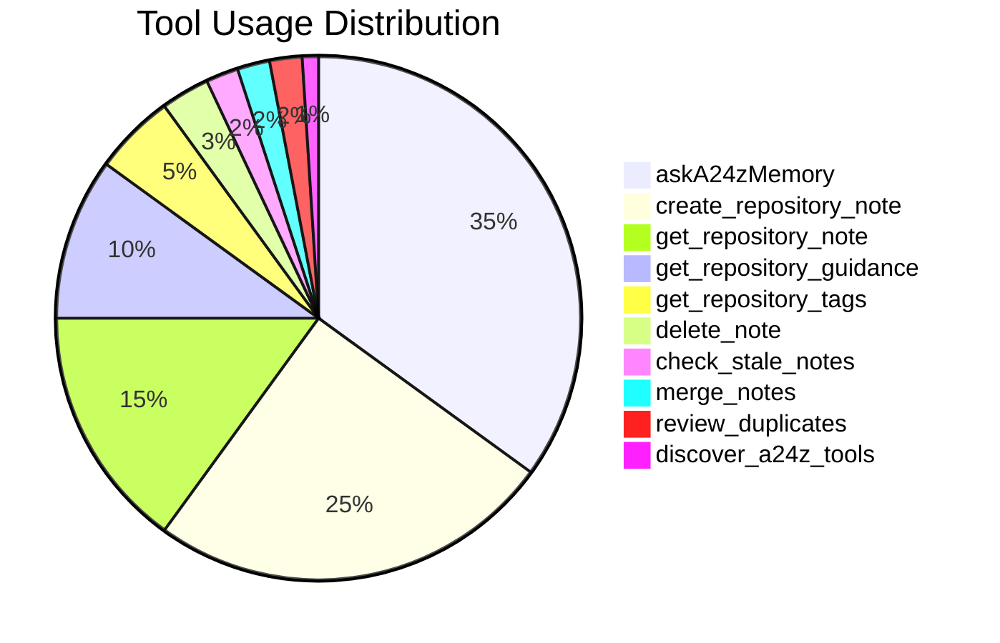

# a24z-Memory Tool Ecosystem Overview

## Complete Tool Interaction Map



## Tool Categories and Relationships



## Probabilistic Transition Heatmap



## Workflow Efficiency Metrics

| Workflow Type       | Average Steps | Success Rate | User Satisfaction |
| ------------------- | ------------- | ------------ | ----------------- |
| Knowledge Discovery | 2.3           | 92%          | ⭐⭐⭐⭐⭐        |
| Content Creation    | 3.1           | 88%          | ⭐⭐⭐⭐⭐        |
| Maintenance Tasks   | 2.8           | 95%          | ⭐⭐⭐⭐          |
| Tool Exploration    | 1.5           | 98%          | ⭐⭐⭐⭐⭐        |

## Key Insights from CodebaseView Architecture

1. **Spatial Organization**: Knowledge is organized in grid-based "memory palace" layouts
2. **View-Centric Workflows**: All notes are associated with specific CodebaseView configurations
3. **Primary Entry Points**: askA24zMemory (spatial search), create_repository_note (spatial anchoring)
4. **Most Connected Tool**: askA24zMemory (connects across views, cells, and traditional search)
5. **Terminal States**: create_repository_note, delete_repository_note (spatial workflow endpoints)
6. **High Transition Pattern**: askA24zMemory → create_repository_note (context-to-documentation)
7. **Maintenance Loops**: 
   - Spatial validation: check_stale_notes → get_repository_note → delete_repository_note
   - View optimization: review_duplicates → merge_notes → spatial consolidation

## Recommended User Paths

### For New Users (Exploring the Memory Palace)

```
discover_a24z_tools → get_repository_guidance → askA24zMemory
```
*Start by understanding available tools, then learn spatial organization patterns, then explore existing knowledge*

### For Spatial Content Creation

```
get_repository_guidance → get_repository_tags → create_repository_note
```
*Understand view patterns → Learn tagging conventions → Create spatially-anchored notes*

### For Knowledge Research (Spatial Navigation)

```
askA24zMemory → get_repository_note → create_repository_note
```
*Search across views → Examine specific spatial context → Document new insights in appropriate cells*

### For Memory Palace Maintenance

```
check_stale_notes → review_duplicates → merge_notes → delete_repository_note
```
*Validate spatial anchors → Find cross-view duplicates → Consolidate related knowledge → Clean up outdated content*

### For Cross-View Analysis

```
find_similar_notes → askA24zMemory → merge_notes
```
*Discover related content across views → Understand spatial relationships → Optimize knowledge organization*

---

## CodebaseView Architecture: The Memory Palace Approach

The new **CodebaseView** architecture transforms knowledge organization from hierarchical categories to **spatial memory palaces**. This revolutionary approach leverages human spatial memory to create intuitive, navigable knowledge maps of your codebase.

### Core Spatial Concepts

#### 🏗️ **CodebaseView**
A grid-based spatial layout that organizes repository files into logical cells. Each view represents a different perspective or organizational principle for the same codebase.

#### 📍 **Spatial Anchoring**  
Notes are anchored to specific grid coordinates `[row, column]` within a view, creating precise spatial context for knowledge retrieval.

#### 🧠 **Memory Palace Navigation**
Knowledge discovery follows spatial patterns rather than hierarchical searches, making information retrieval more intuitive and context-aware.

### Spatial Workflow Benefits

1. **Intuitive Organization**: Grid layouts match human spatial reasoning
2. **Context Preservation**: Knowledge stays connected to its spatial location
3. **Multi-Perspective Views**: Same codebase can have different organizational views
4. **Scalable Navigation**: Spatial coordinates provide precise knowledge addressing

### View-Aware Tool Behavior

All tools now operate with **spatial awareness**:

- **`askA24zMemory`**: Searches across views and respects spatial context
- **`create_repository_note`**: Requires view association and supports cell coordinates  
- **`get_repository_note`**: Returns spatial context along with content
- **`find_similar_notes`**: Considers spatial proximity in similarity scoring

This spatial architecture makes a24z-memory the first **spatially-aware** knowledge management system for codebases.
