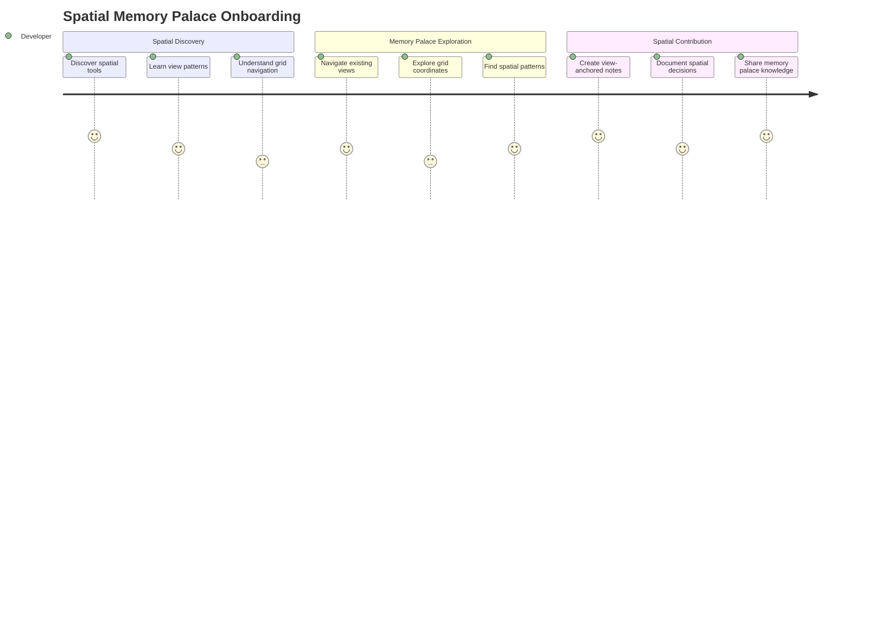
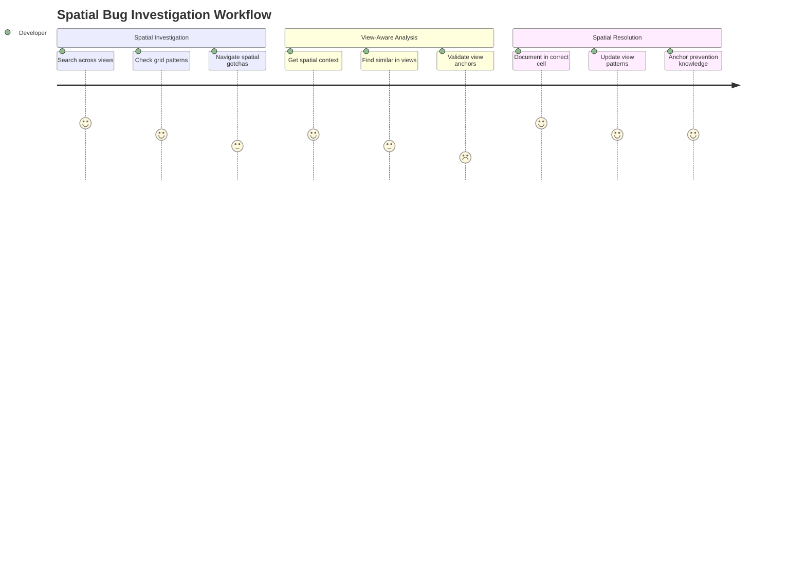
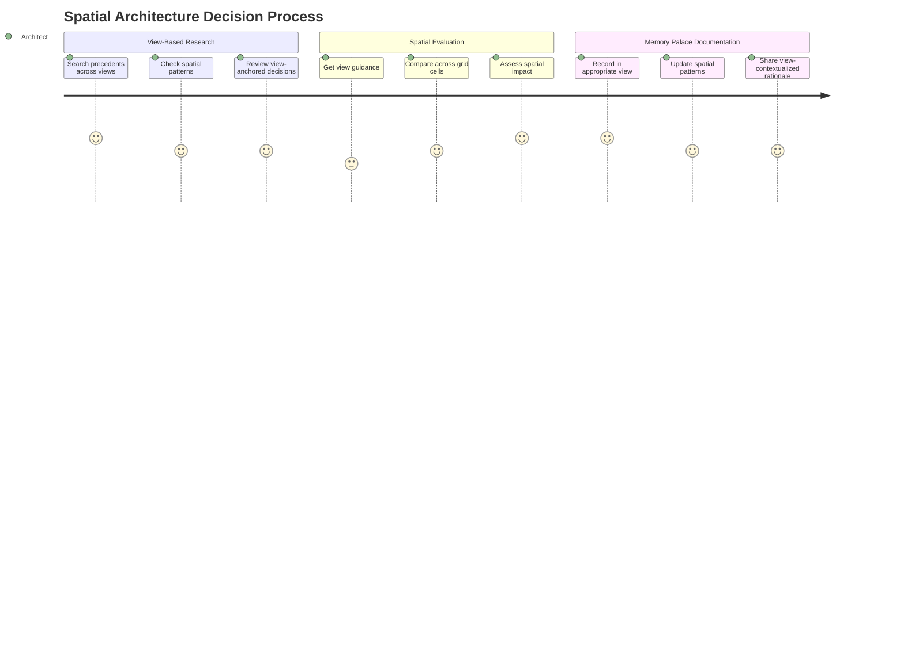
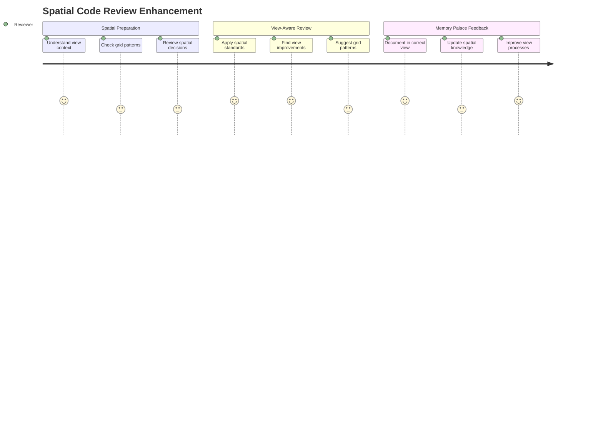
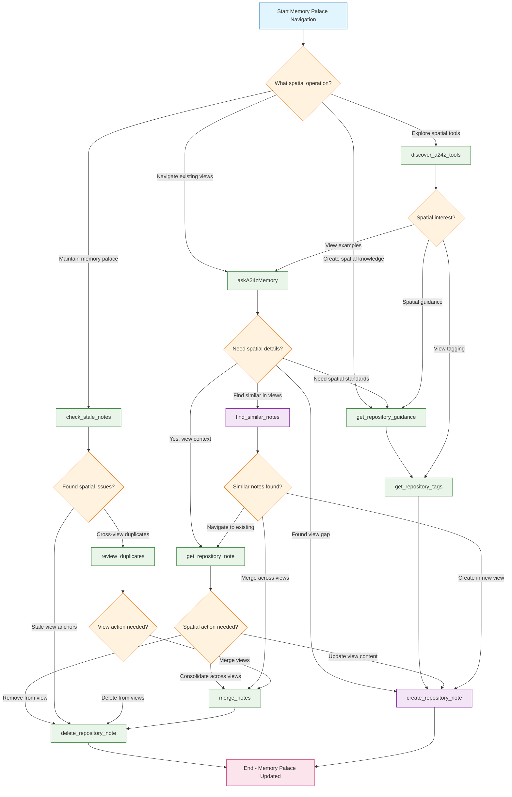
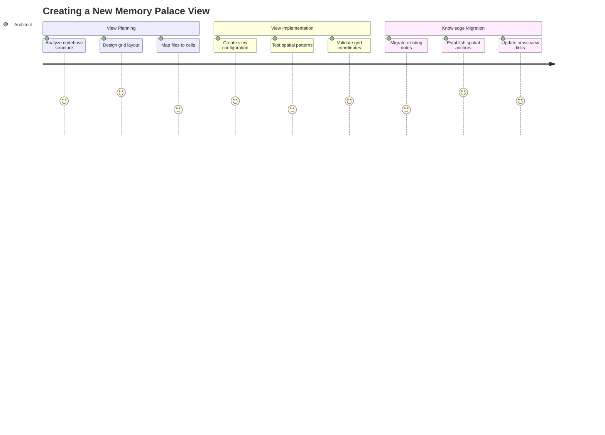

# Spatial User Journey Workflows - CodebaseView Architecture

## New Developer Memory Palace Onboarding

## Spatial Bug Investigation Journey

## Spatial Architecture Decision Journey

## Spatial Code Review Journey

## Spatial State Transition Flow - Memory Palace Navigation

## New CodebaseView Journey: Memory Palace Creation

